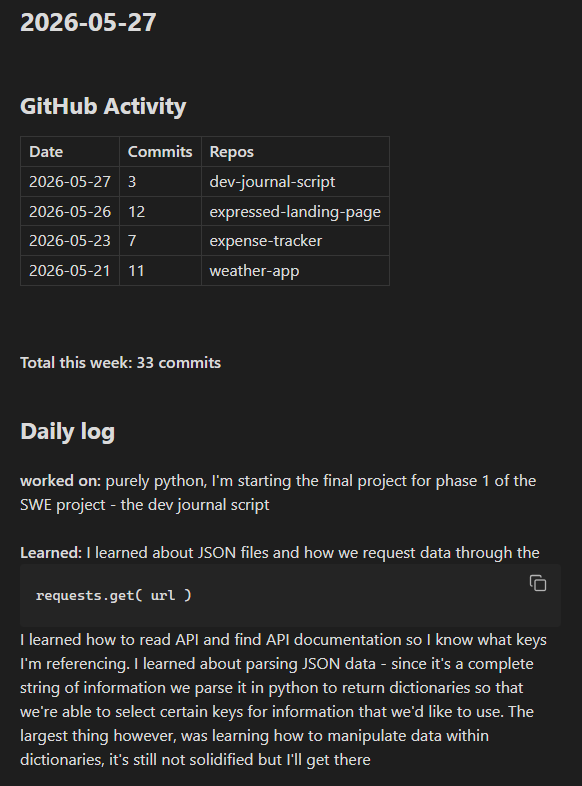

# dev-journal-script

A python scripts that fetches your recent GitHub 
commit history and allows user input for an evening 
dev journal which gets written directly to your obsidian
vault

## Live Demo

[vClaudio11.github.io/dev-journal-script](https://vClaudio11.github.io/dev-journal-script)

## Screenshot



## Built With

- python - Pathlib, datetime imports, request API and parse JSON data, string comprehension, 
params, dictionaries, opening/closing and writing into files 

## Features

- Fetches and displays recent GitHub commit history
- Asks and displays user input for journal entries


## Getting Started

### Prerequisites
- Python 3.x — download at [python.org](https://python.org)
- An [Obsidian](https://obsidian.md) vault (or any local folder to save logs)
- The `requests` library — install with:

```bash
pip install requests
```

### Setup

1. Clone the repository:
```bash
git clone https://github.com/vclaudio11/dev-journal-script.git
cd dev-journal-script
```

2. Create a `config.py` file in the root folder using `config.example.py` as a template:
```python
GITHUB_USERNAME = "your-github-username"
OBSIDIAN_PATH = "path/to/your/obsidian/vault/Dev Logs"
```

3. Create a `Dev Logs` folder inside your Obsidian vault — this is where daily logs will save

4. Run the script each evening:
```bash
python journal.py
```

## Note

`config.py` is gitignored — it contains your personal file paths and is never committed.
A `config.example.py` is included showing the required structure.
## Roadmap

- [ ] make a dedicated frontend input system
- [ ] change display format layout
- [ ] customize display based on Obsidian markup
- [ ] get more GitHub profile data and display it

## License

This project is open source and available under the 
[MIT License](LICENSE).
